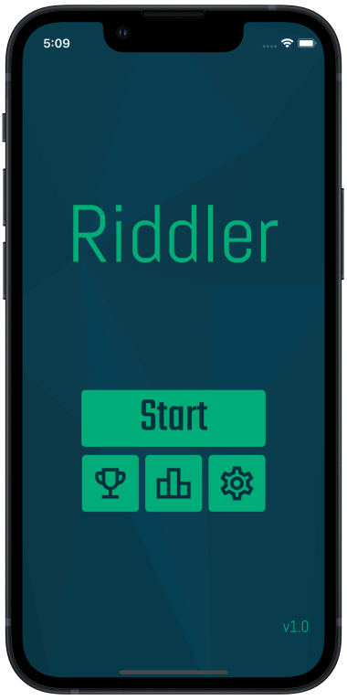
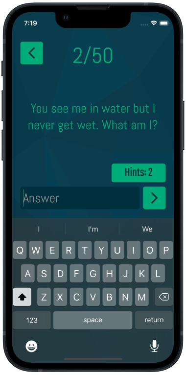
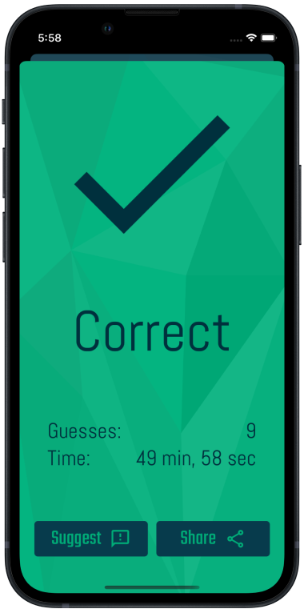

# Riddler for iOS

Riddler is a riddle game built as a native iOS app in Swift using SwiftUI. It includes 50 challenging riddles with hints for when you get stuck. The game tracks your stats so you can compare your performance against your friends, and see who can answer all 50 riddles the quickest.

Riddler was featured in the **'New games we love'** section of the App Store as well as reaching **No. 28** in the **'Word'** game chart.

Check it out on the [App Store](https://apps.apple.com/us/app/riddler-can-you-solve-it/id1615311096).

## Note
> This respository will not compile out of the box. Some files are not included due to including confidential information, such as private keys.

## Features
- UI built programmatically using SwiftUI
- JSON data parsing for persistant user data storage
- Achievements and leaderboards implemented using Apple GameKit
- Privacy consent collection using Google User Messaging Platform
- Interstitial and rewarded ads using AdMob
- Firebase analytics and crashyltics for stability monitoring 

## How it looks...

  
   
  

