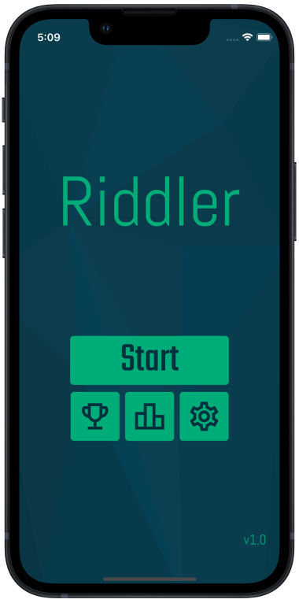
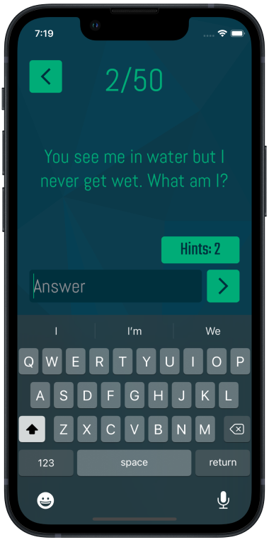
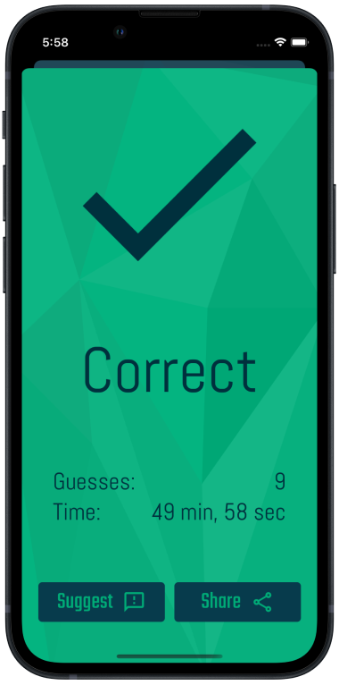

# Riddler for iOS

Riddler is a native iOS app built in Swift using SwiftUI to be a riddle game. It includes 50 challenging riddles with hints for when you get stuck. The game also contains stat tracking to compare your performance against your friends to see who can answer all 50 riddles the quickest.

Check if out on the [App Store](https://apps.apple.com/us/app/riddler-can-you-solve-it/id1615311096).

## Features:
- UI built programmatically using SwiftUI
- JSON user data parsing for persistant data storage
- Achievements and leaderboards implemented using GameKit
- Privacy consent collection using Google User Messaging Platform
- Interstitial and rewarded ads using AdMob
- Firebase analytics and crashyltics for stability monitoring 

## How it Looks...
| Menu                               | Question                             | Correct Answer                             |
|------------------------------------|--------------------------------------|--------------------------------------------|
|  |  |  |
