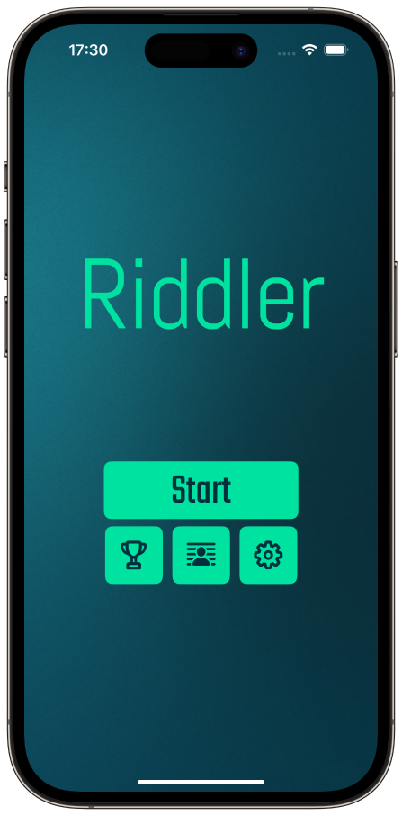
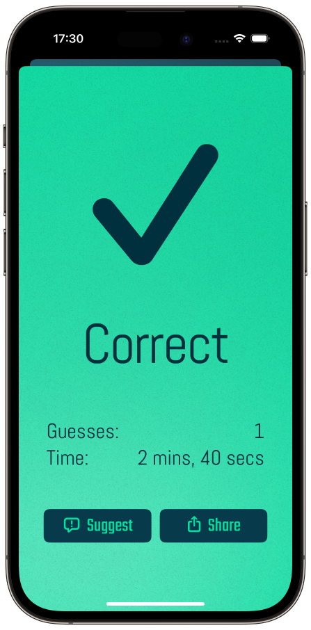

# Riddler for iOS


Riddler is a riddle game built as a native iOS app in Swift using SwiftUI. It includes 50 challenging riddles with hints for when you get stuck. The game tracks your stats so you can compare your performance against your friends, and see who can answer all 50 riddles the quickest.

Riddler was featured in the **'New games we love'** section of the App Store as well as reaching **No. 28** in the **'Word'** game chart.

[](https://apps.apple.com/us/app/riddler-can-you-solve-it/id1615311096)

## Before Building
> This respository will not compile out of the box. I have excluded the `Info.plist` and `Config.swift` files as they contain private API keys.

In order to build you'll need to use the example configuration files which by running the following command in the root folder:

```bash
cp Riddler/App/ExampleInfo.plist Riddler/App/Info.plist && cp Riddler/App/Config/ExampleConfig.swift Riddler/App/Config/Config.swift
```

## Features
- UI built with SwiftUI
- JSON data parsing for persistant user data storage
- Achievements and leaderboards implemented using Apple's GameKit framework
- Privacy consent collection using Google's User Messaging Platform framework
- Interstitial and rewarded ads which use Google's AdMob service
- General usage analytics using PostHog

## How it looks...
<p float="left">
  
   
  
</p>
